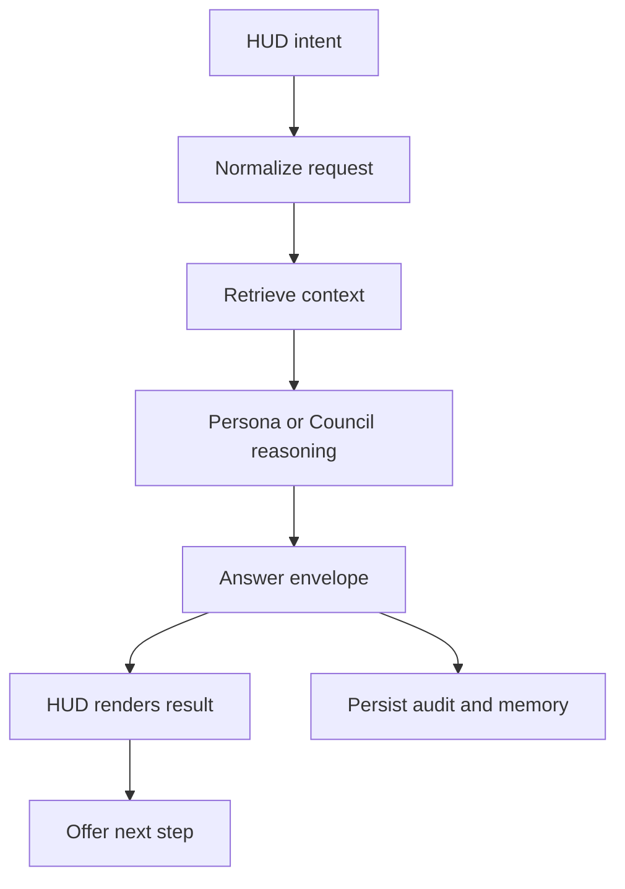

# ATLAS HUD Intelligence Loop V1 Specification

**Status:** Approved for Phase 1 implementation by the Architect on 2026-09-04
**Scope:** HUD-only  
**Version:** 1.0-draft  
**Owner:** ATLAS UX Division + AI Systems  
**Verification:** Inspection, automated tests, integration tests, demonstration

## 1. Decision statement

V1 creates one traceable intelligence loop for every conversational and
teaching action launched from the HUD:

`intent → persona → context → reasoning → answer → evidence → memory → next step`

It does not redesign the HUD, expose backstage systems, or expand ATLAS into
robotics, energy, manufacturing, or other production domains. The approved
core, three-ring layout, Focus Mode, and external AI face dock remain intact.

## 2. Authority and precedence

This specification interprets the current repository authorities in this
order when they overlap:

1. Safety rules and explicit Architect decisions.
2. `UX_DIVISION/PROJECT_GOVERNANCE_STANDARD.md`.
3. `UX_DIVISION/03_HUD_BIBLE.md` and `docs/HUD_HIDDEN_SYSTEMS_POLICY.md`.
4. `UX_DIVISION/05_AI_PERSONALITY_INTERACTION_BIBLE.md`.
5. `docs/ATLAS_TEACHING_CONTRACT.md`.
6. `UX_DIVISION/02_DESIGN_SYSTEM_BIBLE.md`,
   `UX_DIVISION/04_MOTION_LANGUAGE_BIBLE.md`, and accessibility/device bibles.
7. `memory/ATLAS_HUD_V2_STYLE_GUIDE.md` and the design-bank contracts.

No single file named “Master Specification” or “Phase 1 Implementation Plan”
exists in the audited branch. Until those are added or identified, the sources
above are the traceable master set for HUD V1.

## 3. User outcome

From the unchanged HUD, the Architect can ask Ajani, Minerva, Hermes, or the
Council a question, or request a lesson from the Bookshelf/Teaching surface,
and receive one coherent response that:

- preserves the selected persona's voice;
- uses the selected learning depth without lowering intellectual rigor;
- retrieves persona-scoped memory plus shared verified knowledge;
- distinguishes sourced facts, stored context, inference, and uncertainty;
- persists the turn and useful learning state;
- proposes one relevant next action without taking it automatically.

## 4. Non-goals

- No new permanent ring, launcher, dashboard, or bank button.
- No core-orb redesign and no different orb per AI.
- No replacement of Focus Mode, face-dock selection, or approved motion.
- No autonomous external action, robot command, purchase, publish, or deletion.
- No broad redesign of non-HUD pages or backend domains.
- No automatic storage of secrets or raw sensitive prompts.
- No claim that retrieval, confidence, or mastery is proven when it is not.

## 5. Canonical loop



### 5.1 Entry surfaces

V1 covers only these existing HUD entry points:

| Surface | Intent | Canonical persona behavior |
|---|---|---|
| Core + active face | General conversation | Selected AI; Council fans out to three voices |
| Persona Chat panel | General conversation | Selected AI with sticky session |
| Knowledge Bookshelf | Explain selected resource | Selected AI, selected resource, selected depth |
| Teaching Workbench | Teach a topic | Council routes a lead or runs Council when needed |
| Council panel | Route or deliberate | Council contract, not a fourth independent personality |

Other panels can adopt the contract later, but are not V1 completion criteria.

### 5.2 Request contract

The frontend sends a normalized request to the canonical
`/api/v1/hud/intelligence/*` route family. The payload is locked for V1:

```json
{
  "request_id": "client-generated-idempotency-key",
  "intent": "chat | teach | explain_resource | deliberate",
  "persona": "ajani | minerva | hermes | council",
  "message": "user text",
  "session_id": "optional-existing-session",
  "project_id": "optional-project-context",
  "learning_level": "foundation | beginner | intermediate | advanced | undergraduate | graduate | research",
  "resource_ids": ["optional-knowledge-record-id"],
  "client_context": {
    "surface": "core | persona_chat | bookshelf | teaching | council",
    "reduced_motion": false
  }
}
```

Rules:

- `advanced` is the compatibility default only when an older caller omits
  `learning_level`; every updated HUD caller sends it explicitly.
- The backend resolves resource IDs. The client must not inject an entire
  resource summary into the user message as a substitute for retrieval.
- `request_id` makes retries safe and prevents duplicate turns/memory writes.
- Unknown personas, levels, intents, sessions, and resource IDs fail with a
  typed 4xx response.

### 5.3 Context contract: three brains, one shared bank

Each turn retrieves in parallel:

1. **Persona memory:** records owned or tagged for the selected AI.
2. **Shared knowledge:** verified Knowledge Bank records available to all AIs.
3. **Session context:** recent turns for the current session.
4. **Explicit resource context:** exact Bookshelf selections when supplied.
5. **Project context:** only when an authorized `project_id` is supplied.

Council retrieves each AI's persona memory separately, gives all three the same
shared knowledge set, and then synthesizes their labeled perspectives. Council
must expose disagreements rather than erase them.

Retrieval must return stable record IDs, source type, verification state, and a
machine-readable relevance signal. Placeholder hashed embeddings may remain as
a compatibility fallback, but the response must label that retrieval mode; it
must never be presented as semantic certainty.

### 5.4 Reasoning and teaching contract

Every generation receives, in order:

1. Shared safety and honesty rules.
2. Persona identity, domain, voice, and hard rule.
3. The ATLAS Teaching Contract when intent is `teach` or `explain_resource`.
4. Selected knowledge depth.
5. Retrieved memory and knowledge with provenance.
6. Recent session context.
7. The current user request.

The learning level changes **what is taught**, not how difficult the sentences
are. Delivery remains respectful, ADHD-friendly, concrete, and digestible at
every level. Research means PhD/frontier evidence, methods, open questions, and
uncertainty—not more academic filler.

Persona teaching remains distinct:

| AI | Required teaching lens | Hard boundary |
|---|---|---|
| Ajani | Mission, strategy, constraints, risk, disciplined practice | No energy system that cannot be safely contained or shut down |
| Minerva | Story, nature, history, human meaning, evidence | No irreversible harm for optimization |
| Hermes | Mechanisms, interfaces, patterns, tests, practical builds | No self-replicating nanobots |
| Council | Three labeled views plus a decision-oriented synthesis | Never conceal disagreement or bypass human approval |

### 5.5 Response envelope

Every entry surface consumes the same response shape:

```json
{
  "request_id": "same-idempotency-key",
  "run_id": "server-run-id",
  "status": "queued | retrieving | reasoning | complete | partial | failed | cancelled",
  "session_id": "session-id",
  "message_id": "assistant-message-id",
  "persona": "hermes",
  "learning_level": "research",
  "answer": "renderable response",
  "council_voices": [],
  "evidence": [
    {
      "record_id": "knowledge-or-memory-id",
      "kind": "knowledge | memory | resource | project",
      "title": "human-readable label",
      "verification_status": "verified | provisional | unknown",
      "source_url": "optional-safe-url"
    }
  ],
  "confidence": {
    "label": "high | medium | low | unknown",
    "basis": ["short machine-readable reasons"]
  },
  "retrieval_mode": "semantic | lexical | hashed_fallback | none",
  "memory": {
    "turn_saved": true,
    "learning_state_saved": false
  },
  "next_step": {
    "label": "one optional action",
    "intent": "teach | explain_resource | deliberate | open_lab",
    "requires_confirmation": true
  },
  "provider": {
    "name": "provider-or-fallback",
    "model": "model-id",
    "fallback_reason": null
  },
  "error": null
}
```

Confidence is evidence quality, coverage, and agreement—not model emotion and
not a fabricated numeric probability. `unknown` is valid.

### 5.6 Persistence contract

V1 persists:

- the user and assistant turns;
- cited record IDs and verification states used at generation time;
- provider/model/fallback audit fields;
- selected persona and learning level;
- Council sub-voices and synthesis linkage;
- one append-only run event trail;
- explicit understanding checks or user progress when a teaching flow produces
  them.

V1 does not silently turn every assistant sentence into trusted knowledge.
Generated replies are stored as persona conversation memory and remain distinct
from verified source records. Promotion to shared verified knowledge requires
the existing evidence/approval process.

Deleting a chat session may preserve derived persona memory only when the UI
states that behavior clearly and provides the applicable memory controls.

## 6. HUD state and behavior

The visible states are `idle`, `queued`, `retrieving`, `reasoning`, `streaming`,
`complete`, `partial`, `failed`, and `cancelled`.

- The core remains the anchor in every state.
- Rings use existing slow motion; no generic spinner replaces system identity.
- Persona color is an accent, never a total reskin.
- A compact status phrase may surface temporarily: “checking memory,” “reading
  selected source,” or “Council comparing views.” Internal databases and queues
  never become destinations.
- Evidence appears as a collapsible part of the answer, not a permanent bank
  panel.
- Failures keep the user's draft and provide Retry. Retries reuse `request_id`.
- Closing a surface stops client polling/streaming. Server cancellation must be
  explicit; the UI must not claim a job was cancelled merely because polling
  stopped.
- Reduced-motion mode removes ornamental particles and continuous pulses first,
  while preserving state through text and contrast.

Locked motion remains: 6000 ms core breathing at 4%, 36000 ms ring idle,
180 ms panel entry, and 520 ms snap-back. Persona pulse timing remains Ajani
1800 ms, Minerva 2200 ms, Hermes 1400 ms, Council 2600 ms.

## 7. Safety, privacy, and authority

- Personas propose; the Architect decides.
- High-risk domains receive conceptual, safety-conscious teaching rather than
  dangerous step-by-step instructions.
- No response envelope may contain executable actuator commands.
- Any future external or consequential action requires a separate confirmation
  boundary and is outside V1.
- Secrets and credentials are redacted from telemetry and must not be stored as
  memory.
- Provider failure degrades honestly. An offline or fallback response must be
  labeled; no fabricated “live” result is allowed.
- Multi-user deployment requires authorization on session and project reads;
  the current architect-only assumption is not sufficient for that future mode.

## 8. Requirements and acceptance criteria

| ID | Requirement | Verification | Acceptance criterion |
|---|---|---|---|
| HIL-001 | One canonical request/response contract serves all V1 HUD entry surfaces | Inspection + integration test | All five surfaces send/consume the normalized contract |
| HIL-002 | Persona identity and hard rules are server-owned | Test | Prompt-contract tests pass for all personas and Council |
| HIL-003 | Teaching depth and delivery are independent | Test | All seven levels round-trip; clarity law remains present |
| HIL-004 | Retrieval separates persona memory from shared knowledge | Integration test | Fixtures prove persona isolation and shared access |
| HIL-005 | Exact selected resources are resolved by ID | Integration test | Bookshelf answer cites the selected record or reports it unavailable |
| HIL-006 | Council uses three distinct contexts and exposes disagreement | Test + demonstration | Three labeled voices and synthesis are returned |
| HIL-007 | Evidence provenance is renderable and auditable | Test | Stable IDs, type, status, and source fields round-trip |
| HIL-008 | Confidence is honest and explainable | Test | No unsupported numeric confidence; `unknown` supported |
| HIL-009 | Retries are idempotent | Integration test | Same `request_id` creates no duplicate messages or memory |
| HIL-010 | Generated chat is not promoted to verified knowledge automatically | Inspection + test | Stores remain typed and promotion requires approval |
| HIL-011 | HUD preserves approved face and hidden-system boundary | Visual regression + inspection | No new permanent controls; orb/rings/dock unchanged |
| HIL-012 | Motion and accessibility contracts hold | Automated accessibility + visual test | Keyboard, focus, contrast, reduced motion, and live status pass |
| HIL-013 | Failures and fallback are truthful | Fault-injection test | Partial/offline/provider failures are labeled and recoverable |
| HIL-014 | Runs are observable without leaking sensitive content | Test | Correlated events exist; secrets/raw prompt bodies absent from logs |
| HIL-015 | No consequential action executes from the loop | Security test | Action suggestions require confirmation and contain no raw commands |

## 9. Current-state audit and drift

| Area | Current evidence | Drift / risk | V1 disposition |
|---|---|---|---|
| Persona Chat | `/api/persona/{persona}/chat` retrieves memory + knowledge and persists turns | Persona registry colors/domains conflict with locked HUD identity; teaching contract is not assembled here | Make server persona registry canonical and contract-compliant |
| Bookshelf Ask | `KnowledgeBookshelf.js` calls legacy `/api/chat/send` with a prose-built resource summary | Bypasses grounded persona route, stable citations, shared envelope, and explicit level field | Migrate to canonical loop using `resource_ids` |
| Teaching | `TeachingWorkbench.js` uses `/api/atlas/teach` jobs and seven levels | Separate result/state contract; four-band output can blur selected depth | Adapt to canonical envelope while preserving background execution |
| Council | Persona route has true fan-out+synthesis; `CouncilPanel.js` also calls older `/api/council/*` routes | Two Council implementations can disagree | One Council orchestrator; keep route-only behavior as an intent |
| Core trigger | `CoreChatBridge.js` simulates a face-card double-click after core click | DOM-event coupling is fragile and inaccessible | Replace with explicit HUD state action, with no visual redesign |
| Sessions | Persona Chat keeps one session ID per persona in `localStorage` | No schema version, user scope, or cross-surface handoff | Add scoped session adapter and migration-safe key |
| Job cancellation | `useAtlasJob` stops polling/aborts submission on close | Comment implies backend work stops, which is not guaranteed after acceptance | Separate “stop watching” from confirmed server cancellation |
| Evidence | Persona response returns ID arrays | UI shows only counts; no source title/status and no confidence basis | Return structured evidence and render it on demand |
| Memory | Assistant responses mirror to Memory Bank | Generated content may look equivalent to verified knowledge; deletion semantics are surprising | Preserve typed provenance; disclose retention; never auto-promote |
| Retrieval | Memory search may use hashed placeholder embeddings; knowledge search is lexical | Relevance quality may be overstated | Return `retrieval_mode`; treat confidence accordingly |
| Hidden systems | Policy says banks/graphs stay backstage | Legacy components exist and some docs register visible bank panels | V1 adds no launcher; only contextual evidence/results surface |
| Visual tokens | Multiple docs contain conflicting persona colors | Risk of per-component identity drift | Resolve to locked HUD colors before implementation |

## 10. Approval record

The Architect approved implementation on 2026-09-04. The approval covers:

1. This V1 scope and canonical loop.
2. The request/response envelope.
3. The explicit drift resolutions, especially persona identity, hidden systems,
   session retention, and Council consolidation.

Phase changes remain gated by the acceptance criteria in this specification.
4. The implementation sequence in the companion plan.

Approval of this specification does not authorize non-HUD scope or autonomous
consequential actions.
